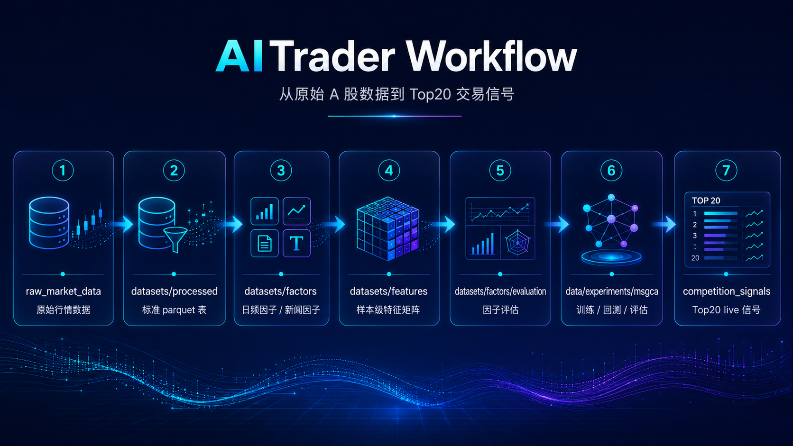
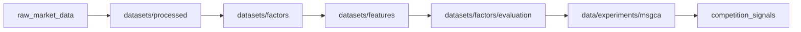
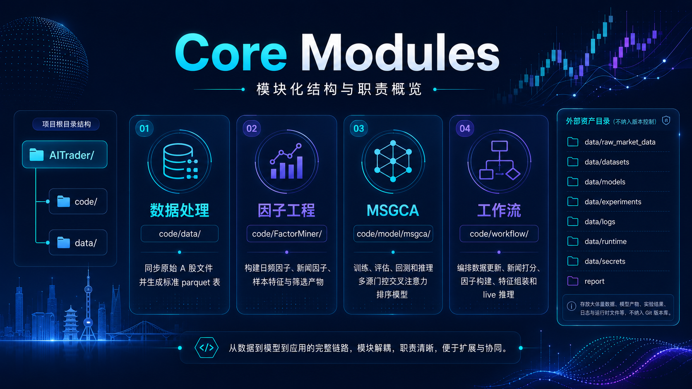

<p align="center">
  
</p>

# AITrader

<p align="center">
  
  
  
  
</p>

<p align="center">
  面向 A 股 Top20 选股任务的研究与模拟交易系统。<br>
  覆盖数据同步、标准表构建、因子工程、MSGCA 排序模型、策略回测与 live 信号生成。
</p>

> **定位说明**
> 本仓库用于 A 股 Top20 选股研究、模型实验和模拟交易流程复现。项目输出的排名与信号仅用于研究和模拟环境，不构成投资建议。

本文档只描述项目级信息。各模块的输入、输出、脚本和参数说明见对应目录 README。

## 项目概览

| 项目 | 内容 |
| --- | --- |
| 任务 | A 股 Top20 选股研究与模拟交易 |
| 模型 | MSGCA 多源门控交叉注意力排序模型 |
| 数据形态 | 原始行情、标准 `parquet` 表、因子表、样本级特征矩阵 |
| 核心流程 | 数据同步 -> 因子构建 -> 特征组装 -> 模型训练/评估 -> 回测 -> live 信号 |
| 运行环境 | `aitrader` conda 环境 |
| 许可证 | Apache License 2.0，见 `code/LICENSE` |

## 系统流程

<p align="center">
  
</p>

AITrader 将原始 A 股行情数据加工为标准数据集、因子表和样本级特征矩阵，再通过 MSGCA 排序模型完成训练、评估、回测与 live 信号生成。

<details>
<summary>Mermaid 流程图源码</summary>



</details>

## 目录结构

```text
AItrader/
  code/                 Python 代码、训练脚本、工作流和测试
    data/               原始数据同步与标准表构建
    FactorMiner/        因子工程、新闻因子和特征筛选
    model/msgca/        MSGCA 训练、评估、回测和推理
    workflow/           端到端工作流入口
    tests/              单元测试和关键流程测试
    environment.aitrader.yml
  docs/assets/          README 图片资产
  data/                 数据、模型产物、日志和运行状态目录
```

版本控制范围限于代码、说明文档和环境清单。原始行情、特征矩阵、实验记录、报告材料、checkpoint、外部模型权重、日志和运行状态文件作为外部资产管理。

## 核心模块

<p align="center">
  
</p>

| 图标 | 模块 | 路径 | 说明 |
| --- | --- | --- | --- |
| 📥 | 数据处理 | `code/data/` | 同步原始 A 股文件并生成标准 `parquet` 表。 |
| 🧮 | 因子工程 | `code/FactorMiner/` | 构建日频因子、新闻样本因子、样本级特征和特征筛选产物。 |
| 🧠 | MSGCA | `code/model/msgca/` | 训练、评估、回测和推理多源门控交叉注意力排序模型。 |
| 🔁 | 工作流 | `code/workflow/` | 编排数据更新、新闻打分、因子构建、特征组装和 live 推理。 |

## 环境

本文档中的命令默认在 `aitrader` conda 环境中执行，并从 `code/` 目录运行 Python 模块。

```bash
conda env create -f code/environment.aitrader.yml
conda activate aitrader
cd code
```

环境清单由本地 `aitrader` conda 环境导出，文件为 `code/environment.aitrader.yml`。最小 Python 依赖清单位于 `code/requirements.txt`。

## 路径变量

路径默认值由 `code/aitrader_paths.py` 解析。

| 变量 | 默认值 |
| --- | --- |
| `AITRADER_ROOT` | 项目根目录 |
| `AITRADER_DATA_ROOT` | `data/` |
| `AITRADER_RAW_DATA_DIR` | `data/raw_market_data/` |
| `AITRADER_DATASETS_ROOT` | `data/datasets/` |
| `AITRADER_EXPERIMENTS_ROOT` | `data/experiments/` |
| `AITRADER_MODELS_ROOT` | `data/models/` |
| `AITRADER_LOG_DIR` | `data/logs/` |
| `AITRADER_RUNTIME_DIR` | `data/runtime/` |
| `AITRADER_SECRETS_DIR` | `data/secrets/` |

## 快速开始

运行测试：

```bash
conda activate aitrader
cd code
python -m pytest -q tests
```

执行 live 工作流：

```bash
conda activate aitrader
cd code
python -m workflow.run_live_pipeline \
  --target-date YYYY-MM-DD
```

## 数据和模型资产

以下目录作为外部资产目录，不纳入版本控制：

```text
data/raw_market_data/
data/datasets/
data/models/
data/experiments/
data/logs/
data/runtime/
data/secrets/
report/
```

最终 MSGCA 运行目录：

```text
data/experiments/msgca/final/model
```

最终 checkpoint 路径：

```text
data/experiments/msgca/final/model/checkpoints/msgca_best.pt
data/experiments/msgca/final/model/checkpoints/msgca_best.json
```

checkpoint 是大体积二进制产物，跨机器部署时需要通过外部 artifact 存储传输。

## 子文档索引

| 文档 | 内容 |
| --- | --- |
| `code/README.md` | 代码目录结构和通用入口 |
| `code/data/README.md` | 数据同步和标准表构建 |
| `code/FactorMiner/README.md` | 因子工程总览 |
| `code/model/msgca/README.md` | MSGCA 模型训练、评估、回测和推理 |
| `code/workflow/README.md` | 端到端工作流 |
| `data/README.md` | 数据目录边界 |

## License

代码目录包含 `code/LICENSE`，当前许可证文本为 Apache License 2.0。
